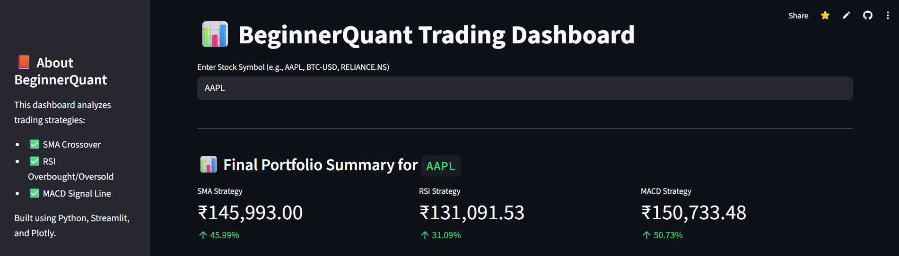
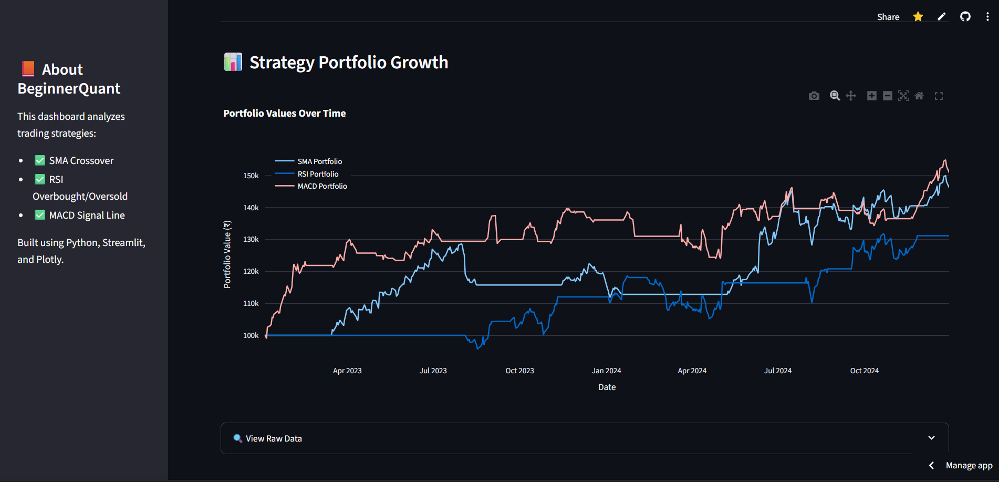

# 📊 BeginnerQuant - AI-Powered Trading Strategy Simulator

🚀 Welcome to **BeginnerQuant**, a beginner-friendly yet powerful tool that simulates trading strategies like **SMA**, **RSI**, and **MACD** on real-time financial data (stocks, crypto, etc.) using **Python**, **Pandas**, **Matplotlib**, and **Streamlit**.

🔗 **Live App**: [Try it Now](https://beginnerquant-gg3kca3rc73rjtr26n4hyj.streamlit.app/)  
📁 **Project Repo**: [View on GitHub](https://github.com/SaiVarunPappla/BeginnerQuant)

---

## 🧠 What It Does

- 📉 Downloads stock or crypto data from **Yahoo Finance**
- ⚙️ Applies **SMA**, **RSI**, and **MACD** strategies
- 📈 Simulates backtesting and visualizes profit/loss over time
- 📊 Interactive charts & outputs in a Streamlit web dashboard
- 💾 Exports results to `.csv` for easy analysis

---

## ⚙️ Strategies Implemented

| Strategy | Description | Signal |
|----------|-------------|--------|
| SMA | Simple Moving Average crossover (20 vs 50) | Buy/Sell |
| RSI | Relative Strength Index (Overbought/Oversold) | Buy below 30 / Sell above 70 |
| MACD | Moving Average Convergence Divergence | Buy when MACD > Signal line |

---

## 🧪 How It Works

1. User inputs any stock or crypto symbol (e.g. `AAPL`, `BTC-USD`, `RELIANCE.NS`)
2. Strategy logic runs and simulates portfolio from ₹100,000
3. Returns, performance, and growth curves are shown
4. CSV file with results is auto-generated

---

## 💻 Technologies Used

- Python 🐍
- Pandas, NumPy
- yFinance API
- Matplotlib & Plotly
- Streamlit

---

## 📷 Screenshots

| SMA / RSI / MACD | Portfolio Growth |
|------------------|------------------|
|  |  |

---

## 🔗 Live Deployment

🟢 Access the live web app:  
👉 [https://beginnerquant-gg3kca3rc73rjtr26n4hyj.streamlit.app/](https://beginnerquant-gg3kca3rc73rjtr26n4hyj.streamlit.app/)

---

## 🤝 Contributing

👨‍💻 Beginner-friendly project. PRs are welcome.  
Create a fork, clone it, and submit a pull request with improvements.

---

## 📄 License

MIT License © [Sai Varun Pappla](https://github.com/SaiVarunPappla)
## 📸 Dashboard Preview

## 📸 Live Dashboard Preview

Here’s a quick preview of the live **BeginnerQuant Streamlit Dashboard**:

### Screenshot 1

### Screenshot 2

